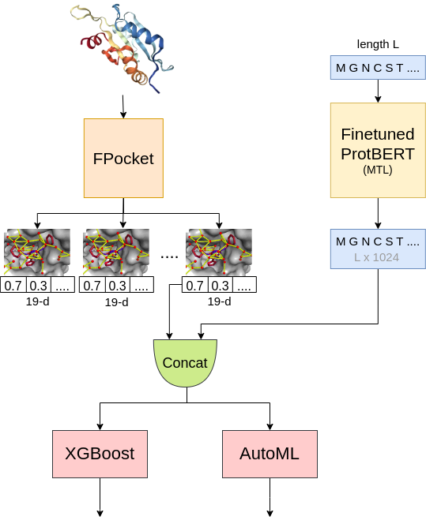

# DeepAllo: Allosteric Site Prediction using Protein Language Model (pLM) with Multitask Learning


Implementation and Inference pipeline for [DeepAllo](https://www.biorxiv.org/content/10.1101/2024.10.09.617427v1)

- [Quick Start](#quick-start)
- [Results](#results)
- [Requirements](#requirements)
- [Citation](#citation)

## Quick Start
1. Create Environment
```bash
conda create -n <environment_name> python=3.11
conda activate <enviroment_name>
pip install -r requirements.txt
```
2. Give *PDB ID* and *Chain ID* at lines 23 and 24, respectively in `inference.py` file.
3. Run the file: `python inference.py`
4. This will give you top 3 pockets with their probability and residue numbers.

## Results
| Model | F1 | Precision | Recall |
| ------------- | ------------- | ------------- | ------------- |
| DeepAllo<sub>*XGBoost*<sub> | 0.8870 | 0.9107 | 0.8644 |
| DeepAllo<sub>*AutoML*<sub> | **0.8966** | **0.9231** | **0.8814** |

## Requirements
1. [Anaconda](https://www.anaconda.com/products/distribution)
2. [CUDA 11.3 or later](https://developer.nvidia.com/cuda-downloads)
3. [PyTorch 1.12 or later](https://pytorch.org/get-started/locally/)
4. [Jupyter Notebook](https://jupyter.org/)

## Citation

```bibtex
@article {Khokhar2024.10.09.617427,
	author = {Khokhar, Moaaz and Keskin, Ozlem and Gursoy, Attila},
	title = {DeepAllo: Allosteric Site Prediction using Protein Language Model (pLM) with Multitask Learning},
	elocation-id = {2024.10.09.617427},
	year = {2024},
	doi = {10.1101/2024.10.09.617427},
	publisher = {Cold Spring Harbor Laboratory},
	URL = {https://www.biorxiv.org/content/early/2024/10/13/2024.10.09.617427},
	eprint = {https://www.biorxiv.org/content/early/2024/10/13/2024.10.09.617427.full.pdf},
	journal = {bioRxiv}
}
```
---
Moaaz Khokhar, Ozlem Keskin, Attila Gursoy:


